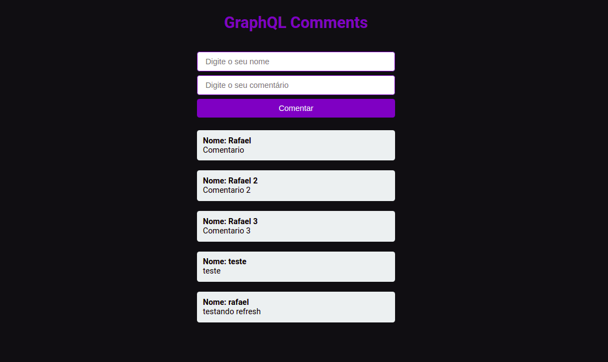

<h1 align="center">GraphQL Comments</h1>

Aplicação para iniciar estudor de GraphQL com Apollo Server

  <a href="#-instalacao-e-execução">Instalação e execução</a>

## 🚀 Instalação e execução

1. Faça um clone desse repositório;
2. Entre na pasta do servidor e instale as dependências `cd server && yarn`;
3. Rode `yarn dev` para iniciar o servidor.
4. Entre no client e inicie o frontend `cd .. && cd client && yarn && yarn start`

## 🤔 Como contribuir

- Faça um fork desse repositório;
- Cria uma branch com a sua feature: `git checkout -b minha-feature`;
- Faça commit das suas alterações: `git commit -m 'feat: Minha nova feature'`;
- Faça push para a sua branch: `git push origin minha-feature`.

Depois que o merge da sua pull request for feito, você pode deletar a sua branch.
